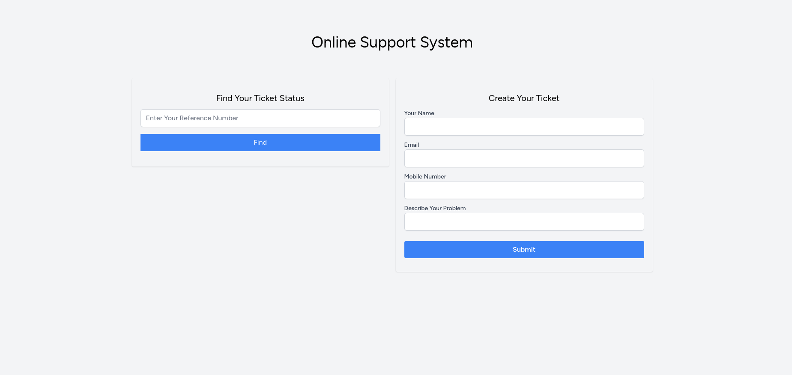
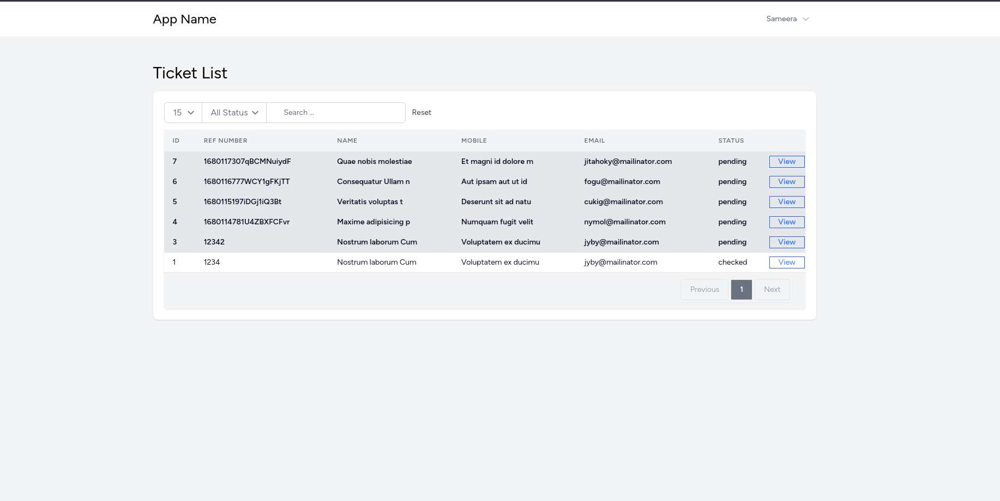

  

# Online Support System

## About Application

Online Support System is a web application which helps service providers and sellers to
provide after-sales support for their customers. Customers are allowed to open a ticket when
they need assistance on something related to the product or service they purchased. Support
agents get in contact with the ticket owner to help resolve their issues.

# Getting started

## Requirements

    PHP 8.1 or above
    [composer](https://getcomposer.org/doc/00-intro.md#installation-linux-unix-macos)
    mysql database

## Installation

Please check the official laravel installation guide for server requirements before you start. 
[Official Documentation](https://laravel.com/docs/9.x/installation)

Clone the repository

    git clone https://github.com/antssanjeewa/Online-Support-System.git

Switch to the repo folder

    cd Online-Support-System

Install all the dependencies using composer

    composer install

Copy that example file as our main .env file with this command

    cp .env.example .env

Edit that new .env file, Change the DATABASE_USER and DATABASE_PASSWORD variables,

    DB_CONNECTION=mysql
    DB_HOST=127.0.0.1
    DB_PORT=3306
    DB_DATABASE=online_support_system
    DB_USERNAME= { DATABASE_USER }
    DB_PASSWORD= { DATABASE_PASSWORD }

And also add the mail configuration details, Change the YOUR_MAIL_ADDRESS and YOUR_MAIL_PASSWORD,
[For more Details](https://www.itsolutionstuff.com/post/laravel-8-mail-laravel-8-send-email-tutorialexample.html?utm_content=sr-left)

    MAIL_DRIVER=smtp
    MAIL_HOST=smtp.gmail.com
    MAIL_PORT=587
    MAIL_USERNAME= { YOUR_MAIL_ADDRESS }
    MAIL_PASSWORD= { YOUR_MAIL_PASSWORD }
    MAIL_ENCRYPTION=tls
    MAIL_FROM_ADDRESS= { YOUR_MAIL_ADDRESS }
    MAIL_FROM_NAME="${APP_NAME}"

Generate a new application key

    php artisan key:generate

Run the database migrations (**Set the database connection in .env before migrating**)

    php artisan migrate --seed

Start the local development server

    php artisan serve

You can now access the server at http://127.0.0.1:8000

After Run Application You can Use to Login Below Credential (use route : http://127.0.0.1:8000/login )

    user_name => admin@test.lk
    password  => password

# More About the project

Assumptions :

-   The support agent can provide multiple replies to a single ticket.
    
-   The login path is hidden from guest users.
    
-   Only 'Pending' and 'Checked' statuses were used for tickets

Improvements :

-   Belongs to many relationship for ticket replies
    
-   Use Vuw3 and InertiaJs for Frontend Development.

<h2>SCREENSHOTS</h2>

1) <h4>Home</h4>
  First Page
   

2) <h4>Ticket List</h4>
  Ticket List Show Table
   

## License
